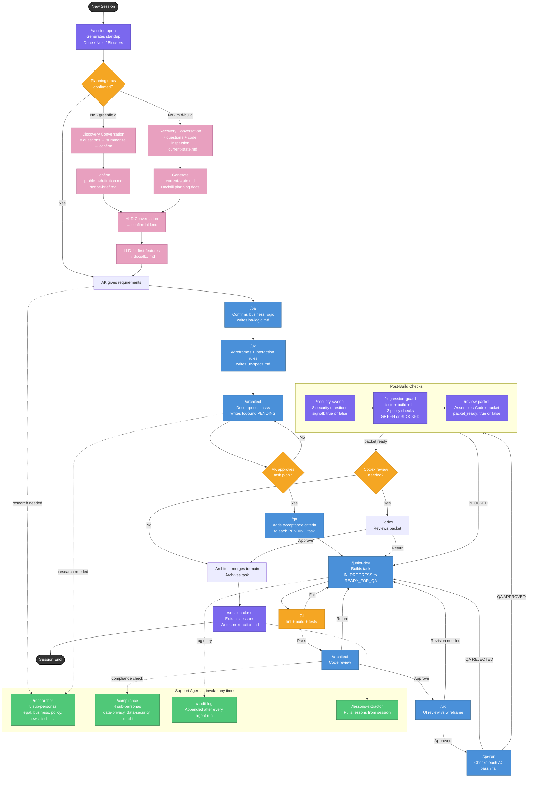

# AK Cognitive OS — Framework Flow

---

## Colour Key

| Colour | Meaning |
|--------|---------|
| Pink | Planning stages (discovery, recovery, HLD, LLD) |
| Blue | Personas (BA, UX, Architect, Junior Dev, QA) |
| Purple | Workflow skills (session-open, security-sweep, etc.) |
| Orange | Decision points |
| Green | Support agents (Researcher, Compliance, Audit Log) |
| Dark | Session start / end |

---

## Reading the Flow

1. **Session opens** → standup → check planning docs
2. **Planning** (if needed): Discovery/recovery conversation → confirm problem-definition, scope-brief, HLD → create LLD for first features
3. **Pre-build**: BA confirms logic, UX draws wireframes, Architect breaks into tasks, QA adds acceptance criteria
3. **Build loop**: Junior Dev builds → CI → Architect reviews → UX checks UI → QA tests each AC
4. **Post-build**: Security sweep + regression guard + review packet (all must pass)
5. **Optional Codex review** for complex sprints
6. **Merge → session close** → lessons extracted → next-action.md written
7. **Support agents** (green) can be called at any point — researcher for questions, compliance for risk checks
